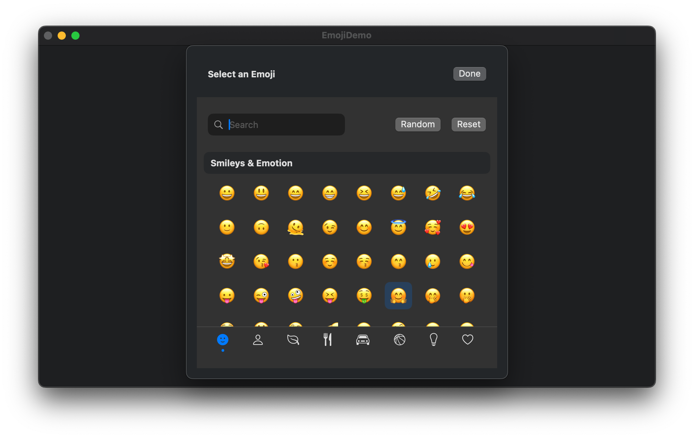

# Elegant Emoji Picker

A modern, customizable emoji picker component for Swift applications on macOS and iOS. This is a SwiftUI fork of [Finalet/Elegant-Emoji-Picker](https://github.com/Finalet/Elegant-Emoji-Picker) with a large-scale rewrite for better platform compatibility.



## Features

- 🔍 Built-in search functionality
- 🎨 Customizable UI and behavior
- 📋 Category-based navigation
- 🔄 Random emoji selection
- 💻 macOS and iOS compatibility

## Installation

### Swift Package Manager

Add the following to your `Package.swift` file:

```swift
dependencies: [
    .package(url: "https://github.com/piercefreeman/Elegant-Emoji-Picker", from: "1.0.0")
]
```

Or add it directly in Xcode:
1. File > Add Package Dependencies...
2. Enter the repository URL: `https://github.com/piercefreeman/Elegant-Emoji-Picker`
3. Choose the version you want to install

## Basic Usage

### Quick Implementation

```swift
import SwiftUI
import EmojiPicker

struct ContentView: View {
    @State private var selectedEmoji: Emoji?
    
    var body: some View {
        VStack {
            // Display selected emoji
            if let emoji = selectedEmoji {
                Text(emoji.emoji)
                    .font(.system(size: 64))
                Text(emoji.description)
                    .font(.caption)
            } else {
                Text("No emoji selected")
                    .foregroundColor(.secondary)
            }
            
            // Use the built-in button component
            EmojiPickerButton(onEmojiSelected: { emoji in
                self.selectedEmoji = emoji
            }) {
                Text("Choose Emoji")
                    .padding()
                    .background(Color.blue)
                    .foregroundColor(.white)
                    .cornerRadius(8)
            }
        }
        .padding()
    }
}
```

### Using EmojiPicker in a Sheet

```swift
import SwiftUI
import EmojiPicker

struct ContentView: View {
    @State private var selectedEmoji: Emoji?
    @State private var isPickerPresented = false
    
    var body: some View {
        Button("Select Emoji") {
            isPickerPresented = true
        }
        .sheet(isPresented: $isPickerPresented) {
            VStack {
                Text("Select an Emoji")
                    .font(.headline)
                    .padding()
                
                EmojiPicker(
                    onEmojiSelected: { emoji in
                        if let emoji = emoji {
                            self.selectedEmoji = emoji
                            isPickerPresented = false
                        }
                    }
                )
                .padding()
                
                Button("Cancel") {
                    isPickerPresented = false
                }
                .padding()
            }
        }
    }
}
```

## Advanced Usage

### Customization Options

The `EmojiPicker` can be extensively customized using the `ElegantConfiguration` and `ElegantLocalization` parameters:

```swift
// Create a custom configuration
let configuration = ElegantConfiguration(
    showSearch: true,
    showRandom: true,
    showReset: true,
    supportsSkinTones: true,
    persistSkinTones: true,
    supportsPreview: true,
    categories: [.SmileysAndEmotion, .PeopleAndBody, .AnimalsAndNature],
    defaultSkinTone: .Medium
)

// Create custom localization
let localization = ElegantLocalization(
    searchFieldPlaceholder: "Search emojis...",
    searchResultsTitle: "Found results",
    searchResultsEmptyTitle: "No matching emojis",
    searchingText: "Searching...",
    randomButtonTitle: "Random",
    resetButtonTitle: "Clear",
    closeButtonTitle: "Done"
)

// Use the customized picker
EmojiPicker(
    configuration: configuration,
    localization: localization,
    onEmojiSelected: { emoji in
        // Handle emoji selection
    }
)
```

### Custom Emoji Sections

You can provide custom emoji sections if needed:

```swift
// Define custom emoji sections
let customSections = [
    EmojiSection(
        title: "Favorites",
        icon: "star.fill",
        emojis: [
            Emoji(emoji: "❤️", description: "Red Heart", category: .SmileysAndEmotion, aliases: ["heart"], tags: ["love"], supportsSkinTones: false, iOSVersion: "1.0"),
            // Add more emojis...
        ]
    ),
    // Add more sections...
]

// Use custom sections
EmojiPicker(
    customSections: customSections,
    onEmojiSelected: { emoji in
        // Handle emoji selection
    }
)
```

### Handling Emoji Selection

When an emoji is selected, you receive an `Emoji` object that contains rich information:

```swift
EmojiPicker(onEmojiSelected: { emoji in
    if let emoji = emoji {
        print("Selected emoji: \(emoji.emoji)")
        print("Description: \(emoji.description)")
        print("Category: \(emoji.category.rawValue)")
        print("Aliases: \(emoji.aliases.joined(separator: ", "))")
        print("Tags: \(emoji.tags.joined(separator: ", "))")
        print("Supports skin tones: \(emoji.supportsSkinTones)")
    } else {
        print("Selection cleared")
    }
})
```

## API Reference

### EmojiPicker

The main component for displaying and selecting emojis.

```swift
public struct EmojiPicker: View {
    public init(
        configuration: ElegantConfiguration = ElegantConfiguration(),
        localization: ElegantLocalization = ElegantLocalization(),
        customSections: [EmojiSection]? = nil,
        onEmojiSelected: ((Emoji?) -> Void)? = nil
    )
}
```

### EmojiPickerButton

A convenience wrapper that displays the emoji picker in a popover when clicked.

```swift
public struct EmojiPickerButton<Label: View>: View {
    public init(
        configuration: ElegantConfiguration = ElegantConfiguration(),
        localization: ElegantLocalization = ElegantLocalization(),
        customSections: [EmojiSection]? = nil,
        onEmojiSelected: @escaping (Emoji?) -> Void,
        @ViewBuilder label: () -> Label
    )
}
```

### Emoji

Represents a single emoji with its metadata.

```swift
public struct Emoji: Decodable, Equatable, Identifiable {
    public var id: String { emoji }
    public let emoji: String
    public let description: String
    public let category: EmojiCategory
    public let aliases: [String]
    public let tags: [String]
    public let supportsSkinTones: Bool
    public let iOSVersion: String
    
    // Methods for skin tone handling
    public func emoji(_ withSkinTone: EmojiSkinTone?) -> String?
    public func duplicate(_ withSkinTone: EmojiSkinTone?) -> Emoji
}
```

### Configuration

```swift
public struct ElegantConfiguration {
    public let showSearch: Bool
    public let showRandom: Bool
    public let showReset: Bool
    public let supportsPreview: Bool
    public let supportsSkinTones: Bool
    public let persistSkinTones: Bool
    public let defaultSkinTone: EmojiSkinTone?
    public let categories: [EmojiCategory]
    
    public init(
        showSearch: Bool = true,
        showRandom: Bool = true,
        showReset: Bool = true,
        supportsPreview: Bool = true,
        supportsSkinTones: Bool = true,
        persistSkinTones: Bool = true,
        defaultSkinTone: EmojiSkinTone? = nil,
        categories: [EmojiCategory] = EmojiCategory.allCases
    )
}
```

## Development FAQ

- "Cannot find XX in scope" - after making changes to our local libraries, you might need to relink the package dependencies for their dependent apps. Xcode seems to lock the global code index at their previous version even though it can see the latest files, so you get compile errors.
- For questions on project structure, see the Swift package template: https://github.com/CypherPoet/swift-package-template

## License

This project is available under the [MIT License](LICENSE.md).

## Acknowledgements

This project is a fork of [Finalet/Elegant-Emoji-Picker](https://github.com/Finalet/Elegant-Emoji-Picker) with macOS compatibility improvements and API refinements.
